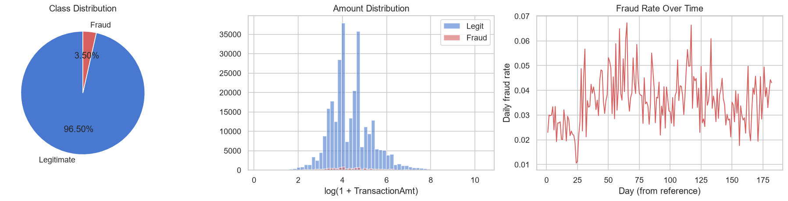
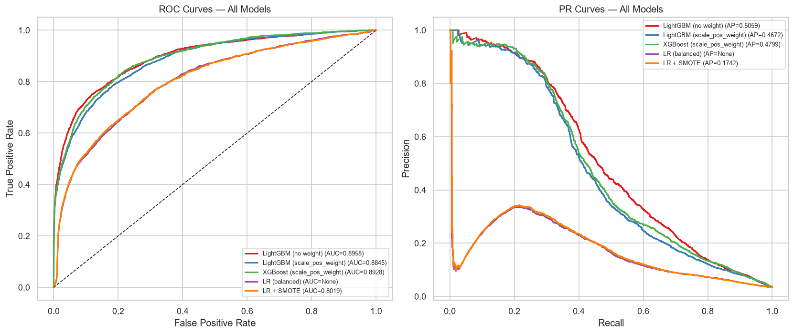
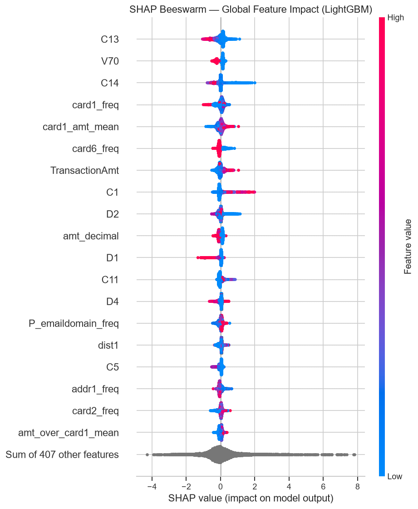
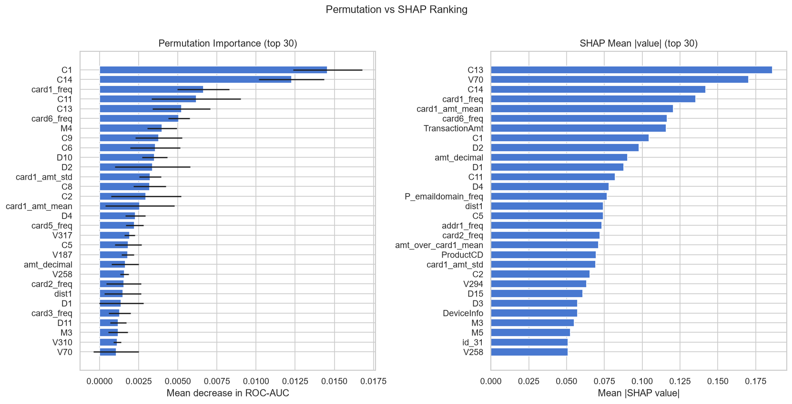

# IEEE-CIS Fraud Detection

Credit card fraud detection on the IEEE-CIS Kaggle dataset using time-based validation, gradient boosting, imbalance handling, and SHAP/LIME explainability.

**Key Results** (50 % stratified sample, ~295 K transactions):
- **Best model:** LightGBM (no class weighting) — ROC-AUC **0.8958**, PR-AUC **0.5059**
- **Business trade-off:** at the chosen threshold, the model catches **42.8 % of fraud cases** at **55 % precision** (~12 false alarms per 1,000 legitimate transactions)
- **Top signals:** count-based features (C13, C14) and card frequency (`card1_freq`) rank in the top 5 of both SHAP and permutation importance
- **LIME caveat:** local explanations were unstable on this 426-feature dataset and disagreed with the global SHAP ranking — a known limitation of LIME on high-dimensional tabular data

---

## Background

Originally started as a course project at Zewail City; fully rebuilt as an individual project.

---

## Dataset

**Source:** [IEEE-CIS Fraud Detection — Kaggle 2019](https://www.kaggle.com/competitions/ieee-fraud-detection)  
590,540 anonymised e-commerce transactions provided by Vesta Corporation.  
**No data is included in this repository.** Download instructions below.

### Feature Families

| Family | Range | Description |
|--------|-------|-------------|
| `TransactionAmt` | — | Transaction amount in USD |
| `C1`–`C14` | 14 features | Counting features — e.g., how many addresses or payment cards are associated with the card number. Exact definitions withheld by the data provider. |
| `D1`–`D15` | 15 features | Time-delta features — e.g., days since the previous transaction on the same card. Exact definitions withheld. |
| `M1`–`M9` | 9 features | Match flags — e.g., whether the name on the card matches the name on the address. Exact definitions withheld. |
| `V1`–`V339` | 339 features | Vesta-engineered features covering ranking, counting, and entity relations. Exact definitions withheld for privacy. |
| `card1`–`card6` | 6 features | Payment card attributes (type, category, bank, country) |
| `addr1`, `addr2` | 2 features | Billing address attributes |
| `dist1`, `dist2` | 2 features | Distance features |
| `P_emaildomain`, `R_emaildomain` | 2 features | Purchaser and recipient email domains |
| `id_01`–`id_38`, `DeviceType`, `DeviceInfo` | ~40 features | Identity and device metadata (from the identity table) |

> Exact feature definitions for the C, D, M, and V groups are withheld by the data provider for privacy. The descriptions above are taken from the official Kaggle competition discussion.

Experiments use a 50 % stratified sample (~295 K transactions, seed 42) of the training data due to computational constraints; the sample preserves the fraud rate and temporal order.

---

## Methodology

### 1. Time-based split — the critical design choice

`TransactionDT` is a time offset in **seconds** from an unknown reference date. A random split would place future transactions in the training set, creating data leakage that inflates test metrics.

We use a **strict temporal split** (day ranges computed as `round(TransactionDT ÷ 86,400)`):

| Split | Rows | Period | Fraud rate |
|-------|------|--------|------------|
| Train | 206,689 | Days 1–121 | 3.507 % |
| Validation | 29,527 | Days 121–141 | 3.658 % |
| Test | 59,054 | Days 141–183 | 3.394 % |

The **validation split** is used exclusively for early stopping and threshold selection.  
The **test split** is touched exactly once, for final metric reporting.

### 2. Train-only preprocessing

Every statistic — missing-value thresholds, imputation medians, frequency-encoding maps, aggregation statistics, scaler parameters — is fitted on the training split only, then applied to validation and test. See `src/features.py`.

### 3. Engineered features

| Feature | Description |
|---------|-------------|
| `log_TransactionAmt` | log(1 + amount) — reduces right-skew |
| `amt_decimal` | Fractional cents of the amount (e.g., 0.99 vs 0.00) |
| `hour_of_day`, `day_of_week` | Time-of-day and day-of-week from `TransactionDT` |
| `card1_freq` … `R_emaildomain_freq` | Frequency encoding for card/address/email fields (train only) |
| `card1_amt_mean`, `card1_amt_std` | Per-card1 amount statistics (train only) |
| `amt_over_card1_mean` | Amount relative to card1 average — deviation signal |

Columns with > 90 % missing (computed on train) are dropped.

### 4. Why not accuracy?

The fraud rate is ~3.5 %. A trivial classifier that always predicts "legitimate" achieves ~96.5 % accuracy while catching zero fraud. We report **ROC-AUC** and **PR-AUC** (robust to class imbalance), plus **F1**, **Precision**, **Recall**, and **Recall at 90 % Precision** at a validation-optimised threshold.

---

## Results

> All numbers are taken directly from `reports/metrics.json`.

| Model | ROC-AUC | PR-AUC | Precision | Recall | F1 | Recall@90P |
|-------|---------|--------|-----------|--------|----|------------|
| **LightGBM (no weight)** | **0.8958** | **0.5059** | 0.5497 | 0.4276 | **0.4811** | 0.2161 |
| LightGBM (scale\_pos\_weight) | 0.8845 | 0.4672 | 0.5571 | 0.3847 | 0.4551 | 0.2141 |
| XGBoost (scale\_pos\_weight) | 0.8928 | 0.4799 | 0.5107 | 0.4162 | 0.4586 | **0.2320** |
| LR (balanced) | 0.8016 | 0.1711 | 0.2942 | 0.3029 | 0.2985 | 0.0060 |
| LR + SMOTE | 0.8019 | 0.1742 | 0.3028 | 0.3014 | 0.3021 | 0.0060 |

> Numbers taken directly from `reports/metrics.json`. All thresholds chosen on the validation split; test set touched once for final reporting.
>
> **Best model:** LightGBM without class weighting achieves the highest ROC-AUC (0.8958) and PR-AUC (0.5059). The three gradient-boosting models are close on ROC-AUC (0.89+); the two LR baselines lag at ~0.80. All five are sensible models — the gap reflects tree-based vs. linear capacity on 426 mixed features.

---

## Key Figures

### EDA Overview


### ROC and PR Curves


### SHAP Beeswarm (Global Feature Impact)


### Permutation vs SHAP Importance


---

## Explainability Findings

Numbers below are read directly from `reports/figures/`.

**Count-based features are the strongest signal**: C13 (SHAP #1, permutation #5) and C14 (SHAP #3, permutation #2) rank in the top 5 of both methods. C1 leads permutation importance (#1) but ranks only 8th in SHAP; C11 is 4th in permutation but 12th in SHAP.

**Card-frequency features also rank highly**: `card1_freq` appears in both the SHAP top 5 (#4) and the permutation top 5 (#3). `card6_freq` ranks 6th in both but does not make either top 5.

**V70 shows a SHAP–permutation gap**: it is ranked 2nd by SHAP but near the bottom of the permutation top-30. This is consistent with V70 being correlated with other V-features — when V70 alone is shuffled, the model compensates via the correlated features, making its individual permutation drop small.

**TransactionAmt appears in the SHAP top-10 but not in the permutation top-30**, suggesting that the C and card-frequency features capture most of its information.

**The linear model (LR) partially overlaps with SHAP**: LR's top absolute coefficients are C14, C11, C7, V266, C8 — both methods rank C14 highly, but the remaining LR top features otherwise differ from the SHAP ranking. No amount features appear in the LR top 20, in contrast to their moderate presence in SHAP.

**LIME was unstable on this instance**: the local explanation for the inspected true positive (test row 29) is dominated entirely by anonymised V-features (V113, V330, V118, V162, …) with no overlap with the global SHAP top features. With 426 correlated features, LIME's local linear surrogate is sensitive to the perturbation neighbourhood and should not be interpreted as a reliable local explanation here.

---

## Business Interpretation

At the validation-optimised threshold, the best model (LightGBM without class weighting):
- Catches 42.8 % of all fraud cases (recall = 0.4276) at 54.97 % precision
- Generates ~12 false alarms per 1,000 legitimate transactions (702 FP / 57,050 negatives)
- At 90 % precision (high-confidence alerts), recall drops to 21.6 % — only the clearest fraud signals are flagged

The right operating point depends on the cost ratio of a missed fraud vs. a false review.

---

## How to Run

```bash
# 1. Clone
git clone https://github.com/Joumanayoussef/ieee-cis-fraud-detection.git
cd ieee-cis-fraud-detection

# 2. Create virtual environment
python -m venv .venv
source .venv/bin/activate        # Windows: .venv\Scripts\activate

# 3. Install dependencies
pip install -r requirements.txt

# 4. Download data
#    a. Accept competition rules at kaggle.com/competitions/ieee-fraud-detection/rules
#    b. Download from kaggle.com/competitions/ieee-fraud-detection/data
#    c. Place train_transaction.csv and train_identity.csv in data/raw/

# 5. Run the full pipeline
python src/data.py          # load, sample, split, cache parquet
# Then open and run: notebooks/fraud_detection.ipynb
```

---

## Project Structure

```
ieee-cis-fraud-detection/
├── src/
│   ├── data.py          Load, merge, downcasting, 50%-sample, time-split, parquet cache
│   ├── features.py      Feature engineering (all encoders fitted on train only)
│   ├── train.py         5 models, threshold selection, evaluation, metrics.json
│   └── explain.py       SHAP TreeExplainer, LIME, permutation importance
├── notebooks/
│   └── fraud_detection.ipynb   Main narrative notebook with outputs
├── reports/
│   ├── metrics.json     All evaluation metrics (authoritative numbers source)
│   └── figures/         All saved plots (PNG)
├── data/
│   ├── raw/             train_transaction.csv, train_identity.csv (not in git)
│   └── processed/       Parquet cache + fitted artifacts (not in git)
├── requirements.txt
└── .gitignore
```

---

## Limitations

1. **50 % sample** — Used due to computational constraints. Full-data results may differ.
2. **Anonymised V-features** — V1–V339 are opaque; feature engineering is limited to documented metadata.
3. **Static threshold** — Chosen once on validation; needs periodic recalibration in production.
4. **No temporal decay** — Model weights all training history equally; fraud patterns evolve.
5. **No competition test labels** — Generalisation measured on the last 20 % of training data only.
